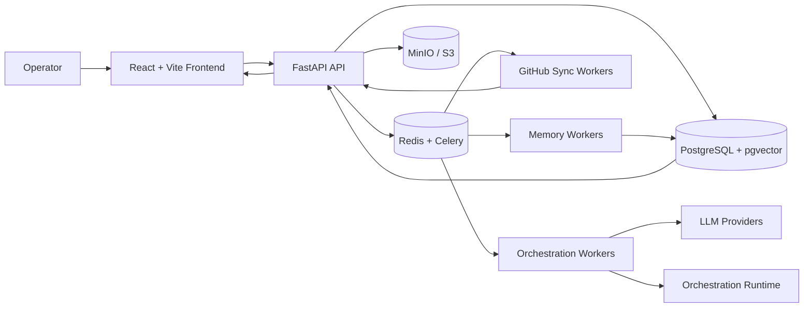

# Troop

AI orchestration platform for coordinating agent workflows, software tasks, GitHub operations, approvals, and execution history in a unified operational workspace.

Troop is designed for teams building AI-assisted engineering and operational workflows where agents are treated as structured system participants rather than isolated prompts.

The platform models agents as:
- versioned workers
- task operators
- collaborative reviewers
- approval-gated executors
- memory-aware participants

instead of simple chat interfaces.

Built with FastAPI, React, PostgreSQL, Redis, Celery, and modular orchestration services, Troop provides a production-oriented environment for managing multi-agent execution pipelines, software workflows, GitHub synchronization, semantic memory, and operational governance.

The system is designed for:
- AI engineering teams
- orchestration research
- agent operations
- internal automation systems
- software delivery workflows
- approval-controlled AI execution

---

# Core Capabilities

- Versioned AI agent registry
- Multi-agent orchestration workflows
- Project and task operations
- GitHub synchronization
- Human approval pipelines
- Semantic and episodic memory
- Durable run tracking
- Brainstorm and collaboration workflows
- Cost and execution analytics
- Queue-driven background execution

> Status: active development platform with production-oriented orchestration architecture and ongoing workflow/runtime expansion.

---

# Why This Platform Exists

Most AI-agent systems are built around isolated prompts and short-lived execution flows.

Troop is designed around a different operational model:
- persistent agents
- structured execution
- replayable workflows
- approval checkpoints
- organizational memory
- operational observability

The platform centralizes:
- agent management
- orchestration logic
- GitHub workflows
- execution history
- semantic memory
- project operations

into a unified operational system for AI-assisted teamwork.

The goal is not fully autonomous execution.

The goal is:
- traceable AI workflows
- controllable orchestration
- reusable agent systems
- operational governance
- scalable human-in-the-loop execution

---

# Screenshots

> Add real screenshots or demo GIFs here.

| Orchestration Dashboard | Agent Hierarchy Builder |
|---|---|
| Add screenshot | Add screenshot |

| Run Inspector | Project Workspace |
|---|---|
| Add screenshot | Add screenshot |

---

# System Architecture



The backend is organized as a modular orchestration platform with domain modules for agents, projects, GitHub synchronization, memory systems, approvals, analytics, and administration.

---

# System Design Highlights

- Modular FastAPI backend architecture
- Queue-driven orchestration runtime
- Versioned agent management
- Semantic and episodic memory systems
- Approval-gated execution flows
- GitHub synchronization pipelines
- Persistent run history and replay
- Multi-provider AI routing
- Containerized local infrastructure stack

---

# Key Features

## Agent Operations

- Agent registry and templates
- Markdown-based agent import
- Agent validation workflows
- Version metadata
- Activation and duplication
- Tool and capability configuration
- Budget and routing policies
- Test-run support

## Multi-Agent Orchestration

- Hierarchical team modeling
- Manager and reviewer roles
- Project-level orchestration
- Task dependencies
- Milestones and timelines
- Working-memory tracking
- Retry, replay, resume, and cancel controls

## Project and Task Workflows

- Project goals and milestones
- Task and subtask management
- Documents and artifacts
- Comments and execution logs
- Timeline snapshots
- Live orchestration state views

## Brainstorm and Collaboration

- Brainstorm rooms
- Participant management
- AI-assisted discussion workflows
- Summary generation
- Promotion to tasks or ADRs
- Collaborative review flows

## GitHub Synchronization

- Repository synchronization
- Issue import workflows
- Approval-gated outbound actions
- Public webhook handling
- Sync-event tracking
- Agent-task assignment flows

## Memory Systems

- Semantic memory
- Episodic memory
- Knowledge chunks
- Knowledge graph relationships
- Memory ingestion jobs
- Project and company memory views

## Platform Administration

- User and tenant management
- Feature flags
- Subscription plans
- API keys
- Webhooks
- Email templates
- Audit logging
- Activity tracking

---

# Example Use Cases

- Multi-agent engineering workflows
- AI-assisted software operations
- GitHub issue orchestration
- Human-in-the-loop automation
- Internal AI copilots
- AI workflow governance
- Persistent memory systems
- Collaborative AI execution environments

---

# Tech Stack

| Area | Technology |
|---|---|
| Backend | FastAPI, SQLAlchemy, Alembic, Pydantic Settings |
| API | REST, Strawberry GraphQL, SSE |
| Database | PostgreSQL, pgvector |
| Jobs | Celery, Redis |
| AI Runtime | LangGraph, OpenAI-compatible providers |
| Frontend | React 19, TypeScript, Vite |
| UI | MUI, Emotion |
| Forms | React Hook Form, Zod |
| Security | JWT cookies, CSRF, Argon2 |
| Infrastructure | Docker, Docker Compose |
| Tooling | pnpm, uv, Ruff, ESLint |

---

# Repository Structure

```text
backend/
├── api/                 # FastAPI app and API routing
├── core/                # Config, logging, storage, telemetry
├── db/                  # Database engine and models
├── modules/             # Domain orchestration modules
├── workers/             # Celery workers and tasks
├── alembic/             # Database migrations
└── pyproject.toml

frontend/
├── src/app/             # Router and providers
├── src/api/             # Typed API clients
├── src/components/      # Shared UI components
├── src/features/        # Feature modules
└── src/pages/           # Route pages

infra/
├── docker-compose.yml   # Local infrastructure stack
└── .env.example
```

---

# Quick Start

## Clone Repository

```bash
git clone <repo-url>
cd troop
```

## Start Infrastructure

```bash
docker compose --env-file infra/.env \
  -f infra/docker-compose.yml up -d
```

## Run Backend

```bash
cd backend

uv sync

uv run alembic upgrade head

uv run uvicorn backend.api.main:app \
  --reload \
  --reload-dir backend \
  --port 8000
```

## Run Frontend

```bash
cd frontend

pnpm install
pnpm dev
```

Open:
- Frontend: `http://localhost:5173`
- API Docs: `http://localhost:8000/docs`
- Mailpit: `http://localhost:8025`
- MinIO Console: `http://localhost:9001`

---

# Local Development Setup

## Configure Environment

```bash
cp backend/.env.example backend/.env
cp frontend/.env.example frontend/.env
cp infra/.env.example infra/.env
```

Replace:
- `JWT_SECRET`
- GitHub secrets
- provider API keys
- storage credentials

## Start Workers

```bash
uv run --project backend celery \
  -A backend.workers.celery_app:celery_app worker \
  --loglevel=INFO \
  --pool=threads \
  --queues=default,email,github,model_gateway,observability,cpu
```

## Optional Celery Beat

```bash
uv run --project backend celery \
  -A backend.workers.celery_app:celery_app beat \
  --loglevel=INFO
```

## Multi-Process Local Runner

```bash
make local-dev
```

This uses:
- Honcho
- Procfile.dev
- Redis
- backend API
- frontend dev server
- Celery workers
- Celery Beat

---

# Environment Variables

## Core Runtime

| Variable | Purpose |
|---|---|
| `APP_ENV` | Runtime environment |
| `DATABASE_URL` | PostgreSQL connection |
| `REDIS_URL` | Redis cache and broker |
| `JWT_SECRET` | Token signing secret |
| `FRONTEND_URL` | Frontend origin |

## Orchestration

| Variable | Purpose |
|---|---|
| `ORCHESTRATION_*` | Runtime orchestration settings |
| `AGENT_TOKEN_BUDGET_WINDOW_DAYS` | Agent budget windows |
| `CELERY_TASK_ALWAYS_EAGER` | Inline task execution for development |

## AI Providers

| Variable | Purpose |
|---|---|
| `AI_*` | AI provider configuration |
| `OPENAI_*` | OpenAI-compatible providers |
| `ANTHROPIC_*` | Anthropic provider settings |

## GitHub Integration

| Variable | Purpose |
|---|---|
| `GITHUB_APP_*` | GitHub App settings |
| `GITHUB_APP_WEBHOOK_SECRET` | Webhook validation |

## Storage and Security

| Variable | Purpose |
|---|---|
| `STORAGE_*` | S3/MinIO configuration |
| `SMTP_*` | Email configuration |
| `CSRF_*` | CSRF protection settings |

---

# API Overview

Base API prefix:

```text
/api/v1
```

Interactive documentation:
- `/docs`
- `/openapi.json`

Main route groups:

| Area | Routes |
|---|---|
| Authentication | `/auth/*` |
| Users & Profiles | `/users/*`, `/profile/*` |
| AI Runtime | `/ai/*` |
| Orchestration | `/orchestration/*` |
| GitHub | `/orchestration/github/*` |
| Brainstorms | `/orchestration/brainstorms/*` |
| Analytics | `/orchestration/analytics/*` |
| Notifications | `/notifications/*` |
| Platform & Admin | `/platform/*`, `/admin/*` |
| GraphQL | `/graphql` |
| Webhooks | `/webhooks/*` |
| Health | `/health/*` |

---

# Main Application Views

| Route | Purpose |
|---|---|
| `/dashboard` | Main orchestration dashboard |
| `/hierarchy-builder` | Agent hierarchy builder |
| `/agent-portfolio` | Agent portfolio |
| `/agent-projects` | Project list |
| `/agent-projects/:projectId` | Project workspace |
| `/brainstorms` | Brainstorm management |
| `/runs/:runId` | Run inspector |
| `/analytics/cost` | Cost analytics |
| `/activity` | Activity and approvals |
| `/model-settings` | Provider configuration |
| `/companies/:companyId/memory` | Company memory |
| `/agent-projects/:projectId/memory` | Project memory |
| `/admin/platform` | Platform administration |

---

# Example Workflows

## Create an Agent from Markdown

```text
Import markdown definition
    ->
Validate configuration
    ->
Activate agent
    ->
Assign to project
```

## Run Project Workflows

```text
Create project
    ->
Assign agents
    ->
Start orchestration run
    ->
Inspect execution state
```

## Sync GitHub Issues

```text
Connect repository
    ->
Import issues
    ->
Assign work to agents
    ->
Approve outbound actions
```

## Host a Brainstorm

```text
Create brainstorm room
    ->
Select participants
    ->
Run collaboration rounds
    ->
Promote output to tasks or ADRs
```

---

# Current Capabilities

- Versioned agent management
- Multi-agent orchestration
- GitHub synchronization
- Semantic memory systems
- Brainstorm workflows
- Durable run tracking
- Approval-gated execution
- Cost analytics
- Queue-driven background execution
- Multi-provider AI routing

---

# Planned / Experimental

- Richer agent planning gates
- Expanded evaluation tooling
- Improved orchestration guardrails
- Code-editing tool integrations
- Better review dashboards
- Advanced memory systems
- CI/CD automation
- Production deployment hardening

---

# Running Tests

## Frontend

```bash
cd frontend

pnpm lint
pnpm test
pnpm build
```

## Backend

```bash
cd backend

uv run ruff check .
uv run ruff format --check .

# Memory layer tests
PYTHONPATH=.. .venv/bin/python -m pytest tests/test_memory_layer.py -q
```

See [docs/MEMORY_LAYER.md](docs/MEMORY_LAYER.md) for AI memory layer setup and configuration.
See [docs/RAG_LAYER.md](docs/RAG_LAYER.md) for document RAG setup, search, and grounded answers.

Top-level checks:

```bash
make check
```

---

# Security Notes

- Replace `JWT_SECRET` before deployment
- Use HTTPS and secure cookies in production
- Keep provider API keys and GitHub secrets outside source control
- Configure webhook validation before public exposure
- Restrict CORS origins in deployed environments
- Review approval flows before enabling outbound GitHub actions
- Keep CSRF protection enabled for cookie-authenticated workflows

---

# Known Limitations

- Full application container deployment is not yet documented
- CI/CD workflows are not yet implemented
- Backend test coverage remains incomplete
- Some GitHub integration workflows remain token-based
- External secret-manager integrations are not yet implemented
- Screenshot/demo assets are not yet included
- License and maintainer information are not yet documented

---

# License

License not yet documented.

